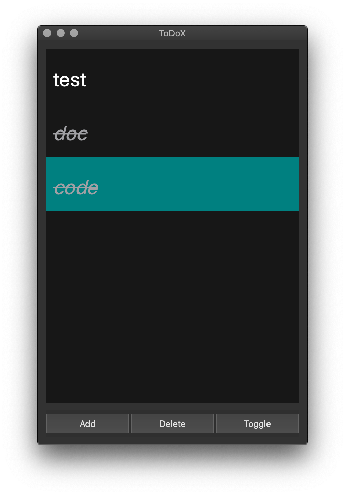

# Back to Qt - Model/View/Delegate

## Overview

I haven't been using Qt framework for a long time. Back to my college days, I used Qt for a while, trying to build desktop apps and polish my C++ skills. Qt went through a lot of changes in recent years, we now have Qt 6. Nowadays, Qt supports building apps with Widgets or QML, one for traditional desktop applications, the other mainly targeted for touch screen devices, which allows developers and designers alike to create highly performant, fluidly animated and visually appealing applications. QML combines usage of JavaScript and JSON-like DSL to build ui in declarative manner, yeah, ***Any application that can be written in JavaScript, will eventually be written in JavaScrip***.
From my perspectives, QML was invented to attract more front-end developers, while Widgets for traditional desktop app developers. This article mainly focuses on Qt widgets technology, which also changed a lot so far, being an iOS/MacOS developer, I wanna test it out, trying to compare it with Cocoa, just for fun :-). As we all known, the best way to get started with a GUI framework is to build a ***TODO List*** app. The final app I built with Qt widgets:



## Model/View/Delegate


Qt widget recommends using model/view/delegate architecture to build complex applications, just another MVC kinda pattern.
>The model communicates with a source of data, providing an interface for the other components in the architecture. The nature of the communication depends on the type of data source, and the way the model is implemented. The view obtains model indexes from the model; these are references to items of data. By supplying model indexes to the model, the view can retrieve items of data from the data source. In standard views, a delegate renders the item of data. When an item is edited, the delegate communicates with the model directly using model indexes.

The architecture is separated into three groups: model, view, delegate. Each of these components is defined by abstract class that provides common interface and default implementation. Abstract classes are meant to be subclassed in order to provide the full set of functionality expected by other components. Model, view and delegates communicate with each other using Qt’s built-in [signals and slots](https://doc.qt.io/qt-6/signalsandslots.html) mechanism.

## TODO List App
Let's dive into model/view/delegates architecture with our todo list app implementation. The app is composed of some widgets, thinking widgets as UIView in UIKit.

***View Hierarchy***
```
QMainWindow
  - QFrame
    - QVBoxLayout
        - QFrame
            - QListView
        - QToolBar
            - QPushButton('Add')
            - QPushButton('Delete)
            - QPushButton('Toggle')
```

### Model
First of all, we need to define our model, the model inherits from ***QAbstractListModel***, which is needed by our ***QListView*** widget.

```cpp
#ifndef TODOMODEL_H
#define TODOMODEL_H

#include <QObject>
#include <QList>
#include <QAbstractListModel>
#include <QVariant>

struct TodoItem
{
 public:
    QString title;
    enum Status {
        normal = 0,
        wip = 1,
        completed = 2,
    } ;

    Status status;
};
Q_DECLARE_METATYPE(TodoItem);

class TodoModel : public QAbstractListModel
{
    Q_OBJECT
public:
    explicit TodoModel(QObject *parent = nullptr);
    QList<TodoItem> *todos;

    int rowCount(const QModelIndex& parent = QModelIndex()) const override;

    QVariant data(const QModelIndex &index, int role) const override;

    bool setData(const QModelIndex &index, const QVariant &value, int role = Qt::EditRole) override;

    void appendTodo(const TodoItem &obj);
    void deleteTodo(const QModelIndex &index);
    void toggleTodo(const QModelIndex &index);

    Qt::ItemFlags flags(const QModelIndex &index) const override;

signals:

};

#endif // TODOMODEL_H
```

As we shown, we defined basic todo struct and operations, ***add***, ***delete*** and ***toggle***. We need to override following methods:

```cpp
int TodoModel::rowCount(const QModelIndex &parent) const
{
    return todos->count();
}


QVariant TodoModel::data(const QModelIndex &index, int role) const
{
    if (!index.isValid())
        return QVariant();

       QVariant var;
       var.setValue(todos->at(index.row()));
       return var;
}

bool TodoModel::setData(const QModelIndex &index, const QVariant &value, int role)
{
    if (!index.isValid() || role != Qt::EditRole) return false;
    TodoItem &obj = (*todos)[index.row()];
    obj = value.value<TodoItem>();
    emit dataChanged(index, index);
    return true;
}
```
* *rowCount*: number of rows in listview
* *data*: specific data for corresponding index
* *setData*: method to update model and trigger *dataChanged* event

Then we need to connect our QPushButton’s events to corresponding operations. e.g

```cpp
m_addBtn = new QPushButton();
m_addBtn->setText("Add");
m_addBtn->setSizePolicy(QSizePolicy::Expanding, QSizePolicy::Expanding);
toolBar->addWidget(m_addBtn);

QObject::connect(m_addBtn, &QPushButton::clicked, this, &MainWindow::appendItem);
```

```cpp

void MainWindow::appendItem()
{
    qDebug() << "append item";

    bool ok;
    QString txt = QInputDialog::getText(this, "Add Todo", "New Todo:", QLineEdit::Normal, "", &ok);

    if (ok && !txt.isEmpty()) {
        TodoItem obj;
        obj.title = txt;
        obj.status = TodoItem::normal;
        m_model->appendTodo(obj);
    }
}
```

### Delegate
Delegate controls rendering and editing of the model. Much like what we did in UIKit, we provide a custom UITableViewCell for UITableView, however the rendering is controlled by the cell itself.

```cpp
#ifndef TODOITEMDELEGATE_H
#define TODOITEMDELEGATE_H

#include <QStyledItemDelegate>
#include <QObject>>

class TodoItemDelegate : public QStyledItemDelegate
{
    Q_OBJECT
public:
    TodoItemDelegate(QObject *parent = nullptr);

    QWidget* createEditor(QWidget *parent, const QStyleOptionViewItem &option, const QModelIndex &index) const override;

    void setModelData(QWidget *editor, QAbstractItemModel *model, const QModelIndex &index) const override;

    void setEditorData(QWidget *editor, const QModelIndex &index) const override;

    QSize sizeHint(const QStyleOptionViewItem &option, const QModelIndex &index) const override;

    void paint(QPainter *painter, const QStyleOptionViewItem &option, const QModelIndex &index) const override;

    void updateEditorGeometry(QWidget *editor, const QStyleOptionViewItem &option, const QModelIndex &index) const override;
};

#endif // TODOITEMDELEGATE_H

```


```cpp
#include "todoitemdelegate.h"
#include "todomodel.h"

#include <QPainter>
#include <QtWidgets/QTextEdit>
#include <QtWidgets/QStyle>
#include <QColor>
#include <QFont>
#include <QString>

TodoItemDelegate::TodoItemDelegate(QObject *parent): QStyledItemDelegate(parent)
{

}


QWidget* TodoItemDelegate::createEditor(QWidget *parent, const QStyleOptionViewItem &option, const QModelIndex &index) const
{
    QTextEdit *edit = new QTextEdit(parent);
    edit->setAlignment(Qt::AlignCenter);
    return edit;
}

void TodoItemDelegate::setEditorData(QWidget *editor, const QModelIndex &index) const
{
    QTextEdit *edit = static_cast<QTextEdit *>(editor);
    const TodoModel *todoModel = static_cast<const TodoModel *>(index.model());
    QVariant obj = todoModel->data(index, Qt::EditRole);
    edit->setText(obj.value<TodoItem>().title);
}

void TodoItemDelegate::setModelData(QWidget *editor, QAbstractItemModel *model, const QModelIndex &index) const
{
    QTextEdit *edit = static_cast<QTextEdit *>(editor);
    const TodoModel *todoModel = static_cast<const TodoModel *>(index.model());
    QVariant var =  todoModel->data(index, Qt::EditRole);
    var.value<TodoItem>().title = edit->toPlainText();
    model->setData(index, var);
}

QSize TodoItemDelegate::sizeHint(const QStyleOptionViewItem &option, const QModelIndex &index) const
{
    return QSize(option.rect.size().width(), 80);
}

void TodoItemDelegate::paint(QPainter *painter, const QStyleOptionViewItem &option, const QModelIndex &index) const
{
    painter->save();
    QRect rect = option.rect;
    const TodoModel *todoModel = static_cast<const TodoModel *>(index.model());

    QVariant obj = todoModel->data(index, Qt::DisplayRole);
    const TodoItem &item = obj.value<TodoItem>();
    if (option.state.testFlag(QStyle::StateFlag::State_Selected)) {
      QBrush brush(QColorConstants::DarkCyan);
      painter->fillRect(rect, brush);
    } else {
        painter->fillRect(rect, option.backgroundBrush);
    }
    QFont f;
    f.setStyleHint(QFont::Monospace);
    f.setPixelSize(30);

    f.setStrikeOut(item.status == TodoItem::completed);
    f.setItalic(item.status == TodoItem::completed);
    painter->setFont(f);

    painter->setPen(item.status == TodoItem::completed ?  QColorConstants::Gray : QColorConstants::White);

     QString str =  QString("%1").arg(item.title);

    painter->drawText(QPoint(rect.left() + 10, rect.top() + rect.height() / 2 + 30 / 2) ,  str);
    painter->restore();
}

void TodoItemDelegate::updateEditorGeometry(QWidget *editor, const QStyleOptionViewItem &option, const QModelIndex &index) const
{
    editor->setGeometry(option.rect);
}

```
TodoItemDelegate creates the needed editor widget (QTextEdit) for editing listview row data, and renders model into screen using *paint* method. Meanwhile, the delegate also decides the geometry size for our cell inside listview, looks like UITableViewDelegate. After the editor widget finishes committing it's changes, delegate updates the model's data immediately.

We can customize editing and rendering behaviors of QListView by providing our own Delegate implementation.


### View
Not surprisingly, we inject our model and delegate into ***QListView***’s properties.

```cpp
m_model = new TodoModel();
m_delegate = new TodoItemDelegate(this);
m_view->setModel(m_model);
m_view->setItemDelegate(m_delegate);
```
***Model*** behaves like a ***UITableViewDataSource*** and ***Delegate*** like a ***UITableViewDelegate***, but with some differences, delegate also controls the editing and rendering of our custom cell. In real usage cases, model should also encapsulate business logic,  providing common interface to manipulate biz data, while delegate acts like a mediator to render model into screen and synchronizes data back into model after handling events from user.


## Insights

Qt Widget’s model/view/delegate architecture resembles a lot like MVC pattern in Cocoa, while QListView corresponds to UITableView in UIKit. Although there are some differences, but the idea is generally the same, only differs in how to separate components' responsibilities.
Worth to mention, Qt also supports building iOS applications with ***QML***, which will be covered in the next coming article. I will also reimplement the above ***TODO List*** app with ***QML*** and do a thorough comparison between ***Widgets*** and ***QML***.

***Preview of QML***
```JavaScript
import QtQuick 2.3

            Rectangle {
            width: 200
            height: 100
            color: "#090F2A"

            Text {
            anchors.centerIn: parent
            text: "Hello, World!"
            color: "#fff"
            }
            }
```

## Source Code
You can find the complete source code in [TodoMVC](https://github.com/LiewLi/TodoMVC)