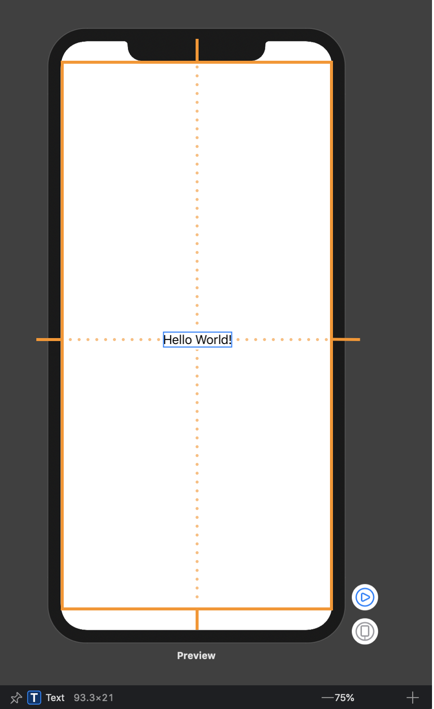

# SwiftUI

## Background

SwiftUI is a declarative UI framework from Apple, introduced at WWDC 2019, that enables developers to build native user interfaces for apps running on either iOS, iPadOS, watchOS, tvOS or macOS. Its highly declarative API makes it quite different from Apple’s previous UI frameworks, such as UIKit and AppKit, which in turn often requires us to adopt a somewhat different set of patterns and conventions when starting to use it.

## Hello World

```swift
struct TutorialView: View {
    @State var counter: Int = 0
    
    var body: some View {
        Text("\(counter)")
            .foregroundColor(.white)
            .font(.title)
        
        Button(action: {
            self.counter += 1
        }) {
            Text("Add one")
                .font(.body)
                .foregroundColor(.white)
                .padding()
                .border(Color.primary, width: 1)
        }
    }
}
```


## View

SwiftUI views needs to conform to **View** protocol, which defined as 

```swift
public protocol View {
    associatedtype Body : View
    @ViewBuilder var body: Self.Body { get }
}
```

SwiftUI has a lot built-in views, they can be divided into two categories, **Simple View** and **Container View**, they are all **View**s in nature, but serve for different funcationalities, **Simple View** for visual content rendering whiles **Container View** for layout purpose. 

Before you start building custom views, it's a good idea to get used to the things SwiftUI already provides you with. We will cover some of the built-in SwiftUI views, sadly not exhaustive.

### Simple View

* ***Color*** 

  `Color` is a view that simply displays a rectangle in the color that you’ve provided. It can also be applied to other views as a foreground or background color through modifiers.

  ```swift
  extension Color {
      static let primary = Color(red: 1.0, green: 0.231, blue: 0.361)
  }
  
  struct ColorView: View {
      var body: some View {
          Color.primary
      }
  }
  ```

  `Color`is similar to `UIColor`, but it implements **View** Protocol, which can be treated as a SwiftUI view

  ```swift
  extension Color : View {
      public typealias Body = Never
  }
  ```

* ***Button***

  `UIButton`

* ***Text***

  `UILabel`

* **Toggle**

  `UISwitch`

* **Slider**

  `UISlider`

* .....

### Container View

#### Stack Views

* `HStack` 

  A view that arranges its children in a horizontal line.

* `VStack`

  A view that arranges its children in a vertical line

* `ZStack`

  A view that overlays its children, aligning them in both axes.

  

 `LazyHStack` `LazyVStack` `LazyZStack`

The stack is “lazy,” in that the stack view doesn’t create items until it needs to render them onscreen.

#### List

A container that presents rows of data arranged in a single column, optionally providing the ability to select one or more members.

```swift
struct Ocean: Identifiable, Hashable {
    let name: String
    let id = UUID()
}

private var oceans = [
    Ocean(name: "Pacific"),
    Ocean(name: "Atlantic"),
    Ocean(name: "Indian"),
    Ocean(name: "Southern"),
    Ocean(name: "Arctic")
]

@State private var multiSelection = Set<UUID>()

var body: some View {
    NavigationView {
        List(oceans, selection: $multiSelection) {
            Text($0.name)
        }
        .navigationTitle("Oceans")
        .toolbar { EditButton() }
    }
    Text("\(multiSelection.count) selections")
}
```

#### Grid

To lay out views horizontally and vertically at the same time, use a [`LazyVGrid`](https://developer.apple.com/documentation/swiftui/lazyvgrid) or [`LazyHGrid`](https://developer.apple.com/documentation/swiftui/lazyhgrid). Grids are a good container choice to lay out content that naturally displays in square containers, like an image gallery.


## Layout System

There are three steps in SwiftUI layout process.

1. **Parent Proposes Size for Child**

   First, the root view offers the text a proposed size – in this case, the entire safe area of the screen, represented by an orange rectangle.

2. **Child chooses its Size**

   Text only requires that much size to draw its content. The parent has to respect the child's choice. It doesn't stretch or compress the child.

3. **Parent places Child in Parent's Coordinate Space**

   And now the root view has to put the child somewhere, so it puts in right in the middle.

   

## State and DataFlow

SwiftUI offers a declarative approach to user interface design. As you compose a hierarchy of views, you also indicate data dependencies for the views. When the data changes, either due to an external event or because of an action taken by the user, SwiftUI automatically updates the affected parts of the interface. As a result, the framework automatically performs most of the work traditionally done by view controllers.


The framework provides tools, like state variables and bindings, for connecting your app’s data to the user interface. These tools help you maintain a single source of truth for every piece of data in your app, in part by reducing the amount of glue logic you write.


**@State @Binding @StateObject @ObservedObject @EnvironmentObject** are all property wrappers provided by SwiftUI to manage data flow.

So what is a property wrapper?

Well, Like the name implies, a property wrapper is essentially a type that *wraps* a given value in order to attach additional logic to it — and can be implemented using either a struct or a class by annotating it with the `@propertyWrapper` attribute. Besides that, the only real requirement is that each property wrapper type should contain a stored property called `wrappedValue`, which tells Swift which underlying value that’s being wrapped. For example

```swift
@propertyWrapper struct Capitalized {
    var wrappedValue: String {
        didSet { wrappedValue = wrappedValue.capitalized }
    }

    init(wrappedValue: String) {
        self.wrappedValue = wrappedValue.capitalized
    }
}
```

We just defined a property wrapper , `@Captalized` , that  automatically capitalizes all String values assigned to it.

```swift
struct User {
	@Capitalized var firstName: String
	@Capitalized var lastName: String
}

var user = User(firstName: "tim" lastName: "cook")
print(user.firstName) // "Tim"
```

What's the difference between **@State @Binding @StateObject @ObservedObject @EnvironmentObject** ?

Well, each serves for a differenent usage case, to summarize

- Manage transient UI state locally within a view by wrapping value types as [`State`](https://developer.apple.com/documentation/swiftui/state) properties.
- Connect to external reference model data that conforms to the [`ObservableObject`](https://developer.apple.com/documentation/Combine/ObservableObject) protocol using the [`ObservedObject`](https://developer.apple.com/documentation/swiftui/observedobject) property wrapper. Gain access to an observable object stored in the environment using the [`EnvironmentObject`](https://developer.apple.com/documentation/swiftui/environmentobject) property wrapper. Instantiate an observable object directly in a view using a [`StateObject`](https://developer.apple.com/documentation/swiftui/stateobject).
- Share a reference to a source of truth — like state or an observable object — using the [`Binding`](https://developer.apple.com/documentation/swiftui/binding) property wrapper.

Well cover them in the following codelab section

## Animation

SwiftUI support two kinds of animations, **implicit animation** and **explicit animation**. 

* Implicit Animation

You can attach animations to a specific view with `animation(_:)`modifier. It will apply the given animation to all animatable values within this view.

* Explicit Animation

Many views might rely on the same state. Instead of apply animations to individual views, you can also apply animations to all views by add animations in places you change your state's value. By wrapping the change of state in `withAnimation` function, all views that depend on that state would be animated.

You can still use `.animation` functions in views, and it will take precedence over `withAnimation`

```swift
struct TutorialView:  View {
    @State var progress: Float = 0
    let timer = LoadingTimer(interval: 1.0)
    
    var body: some View {
        ProgressView(progress: progress)
            .onReceive(timer.publisher) { _ in
                //explicit animation
                withAnimation(.easeInOut) {
                    progress += 0.1
                    progress = min(1.0, progress)
                }
            }
            .animation(.spring()) //implicit animation
            .onAppear {
                timer.start()
            }
            .onDisappear {
                timer.cancel()
            }
    }
}
```


Animation is one of the powerful features of SwiftUI. So easy that we could animate changes in view hierarchy by simply mutating *@State* properties and attaching animation modifiers. SwiftUI also supports more advanced animations like **Hero animation**

```swift
struct HeroAnimationView: View {
    
    @State private var allImages = [
        "heart.fill",
        "bandage.fill",
        "cross.fill",
        "bed.double.fill",
        "cross.case.fill",
        "pills.fill"
    ]
    
    @State private var selectedImages: [String] = []
     
    var body: some View {
        VStack {
            Text("All Images")
                .font(.headline)
            
            allImageView
            
            Spacer()
            
            Text("Selected Images")
            
            selectedImageView
        }
    }
}
```

```swift
private extension HeroAnimationView {
    var allImageView: some View {
        LazyVGrid(columns: [.init(.adaptive(minimum: 44))]) {
            ForEach(allImages, id:\.self) {image in
                Image(systemName: image)
                    .resizable()
                    .frame(width: 44, height: 44)
                    .onTapGesture {
                        withAnimation {
                            allImages.removeAll { $0 == image}
                            selectedImages.append(image)
                        }
                    }
            }
        }
    }   
}
```

By default, SwiftUI uses fade-in and fade-out transitions to animate layout changes. So the animation goes with


With `matchedGeometryEffect` modifier we can achieve more fluid transition,  by attaching *matchedGeometryEffect* to multiple views, we define a connection between them. SwiftUI can use this connection to understand the geometry of transition and automatically apply shape, position, and size transformation between these changes.

```swift
struct HeroAnimationView: View {
	//...
   	//define namespace    
    @State private var selectedImages: [String] = []
  //...
}
```

```swift
var allImageView: some View {
        LazyVGrid(columns: [.init(.adaptive(minimum: 44))]) {
            ForEach(allImages, id:\.self) {image in
                Image(systemName: image)
                    .resizable()
                    .matchedGeometryEffect(id: image, in: imageEffect) //mark unique identifier
                    .frame(width: 44, height: 44)
                    .onTapGesture {
                        withAnimation {
                            allImages.removeAll { $0 == image}
                            selectedImages.append(image)
                        }
                    }
            }
        }
    }
```


## View Modifers

SwiftUI gives us a range of built-in modifiers, such as `font()`, `background()`, and `clipShape()`. However, it’s also possible to create custom modifiers that do something specific.

To create a custom modifier, create a new struct that conforms to the `ViewModifier` protocol. This has only one requirement, which is a method called `body` that accepts whatever content it’s being given to work with, and must return `some View`.

```swift
public protocol ViewModifier {

    /// The type of view representing the body.
    associatedtype Body : View

    /// Gets the current body of the caller.
    ///
    /// `content` is a proxy for the view that will have the modifier
    /// represented by `Self` applied to it.
    @ViewBuilder func body(content: Self.Content) -> Self.Body

    /// The content view type passed to `body()`.
    typealias Content
}
```

For example, we can build a watermark modifier as follows

```swift
struct Watermark: ViewModifier {
    var text: String
    
    func body(content: Content) -> some View {
        ZStack(alignment: .bottomTrailing) {
            content
            Text(text)
                .font(.caption)
                .foregroundColor(.white)
                .padding(5)
                .background(Color.black)
        }
    }
}

extension View {
    func watermark(with text: String) -> some View {
        modifier(Watermark(text: text))
    }
}
```

```swift
struct TutorialView:  View {    
    var body: some View {
        Color.primary
            .frame(width: 300, height: 300)
            .watermark(with: "SwiftUI❤️")
    }
}
```


## MVVM with Combine

### Combine

In Apple’s words, Combine is:

> a declarative Swift API for processing values over time.

Combine is Apple’s take on a functional reactive programming library, akin to [RxSwift](https://github.com/ReactiveX/RxSwift). RxSwift itself is a port of [ReactiveX](http://reactivex.io/). Combine uses many of the same functional reactive concepts that can be found in other languages and libraries, applying the staticly typed nature of Swift to their solution.


* **Publisher** 

  A publisher provides data when available and upon request. A publisher that has not had any subscription requests will not provide any data. When you are describing a Combine publisher, you describe it with two associated types: one for Output and one for Failure.

* **Subscriber**

  A subscriber is responsible for requesting data and accepting the data (and possible failures) provided by a publisher. A subscriber is described with two associated types, one for Input and one for Failure. The subscriber initiates the request for data, and controls the amount of data it receives. It can be thought of as "driving the action" within Combine, as without a subscriber, the other components stay idle.

* **Operator**

  Operators can be used to transform either values or types - both the Output and Failure type.


### MVVM


## Interoperability with UIKit

One of SwiftUI’s major strengths is just how well it integrates with both UIKit. Not only does that act as a useful “escape hatch” for whenever a given use case is not yet natively supported by SwiftUI itself, it also enables us to incrementally migrate an existing UIKit or AppKit-based project to Apple’s new UI framework, all while reusing many of our core UI components. Which means we can refactor exisiting large projects in a progressive manner.

### Using UIKit in SwiftUI

For example, we can wrap a **UIButton** to be used in SwiftUI without too much effort

```swift
struct UIKitView: View {
    @State var count: Int = 0
    
    var body: some View {
        VStack {
            Text("\(count)")
            UIButtonView {
                count += 1
            }.frame(width: 100, height: 80)
        }
    }
}

struct UIButtonView: UIViewRepresentable {
    var handler: () -> Void
    func makeUIView(context: Context) -> some UIView {
        let button = UIButton()
        button.setTitle("Add one!", for: .normal)
        button.addTarget(context.coordinator,
                         action: #selector(Coordinator.callHandler),
                         for: .touchUpInside)
        return button
    }
    
    func makeCoordinator() -> Coordinator {
        Coordinator()
    }
    
    func updateUIView(_ uiView: UIViewType, context: Context) {
        context.coordinator.handler = handler
    }
}

extension UIButtonView {
    class Coordinator {
        var handler: (() -> Void)?
        
        @objc func callHandler() {
            handler?()
        }
    }
}
```


### Embed SwiftUI in UIKit

SwiftUI’s interoperability with UIKit goes the complete opposite direction as well, since we’re also able to embed SwiftUI views within UIKit-based view controllers using **UIHostingController**.UIHostingController is a UIKit view controller that manages a SwiftUI view hierarchy.

Create a `UIHostingController` object when you want to integrate SwiftUI views into a UIKit view hierarchy. At creation time, specify the SwiftUI view you want to use as the root view for this view controller; you can change that view later using the [`rootView`](https://developer.apple.com/documentation/swiftui/uihostingcontroller/rootview) property. Use the hosting controller like you would any other view controller, by presenting it or embedding it as a child view controller in your interface.

```swift
private func makeSwiftUIVC() -> UIHostingController<SwiftUIView> {
  let swiftuiView = SwiftUIView(vm: viewModel)
  let vc = UIHostingController(rootView: swiftuiView)
  vc.view.translatesAutoresizingMaskIntoConstraints = false
  return vc
}
```


## CodeLab


## Reference

* https://developer.apple.com/documentation/swiftui
* https://heckj.github.io/swiftui-notes


